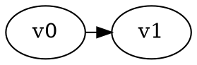
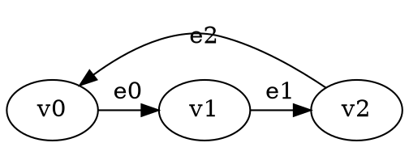

# GGG Temporis: Temporal Reachability Solver & Benchmarking Suite

A **GGG-native temporal game solver** implementing **Presburger arithmetic constraints** with **existential quantifiers**. Includes comprehensive benchmarking scripts, game generation tools, and visualization capabilities.

## 🌟 Features

- **🎮 GGG Integration**: Native `Solver<GraphType, SolutionType>` implementation with stdin support
- **🧮 Presburger Constraints**: Full support for linear arithmetic over integers  
- **∃ Existential Quantifiers**: Express complex mathematical relationships with unlimited variables
- **🔢 Multi-Variable Support**: Constraints with multiple temporal and quantified variables
- **📝 DOT Format Input**: Standard graph format with custom temporal annotations
- **📊 Multiple Output Formats**: Standard, CSV, and time-only output for benchmarking
- **⚡ Professional Build System**: Modern CMake with GGG dependency management
- **🧪 Comprehensive Benchmarking**: Full integration with GGG benchmark infrastructure
- **📈 Visualization Tools**: Performance analysis and comparison plotting

## 🚀 Quick Start

### Prerequisites
- GGG library (Game Graph Gym) in sibling directory
- C++20 compatible compiler
- CMake 3.20+
- Boost Graph Library
- Python 3.7+ (for benchmarking scripts)
- matplotlib (for visualizations)

### Build
```bash
mkdir build && cd build
cmake ..
make
```

### Basic Usage
```bash
# Solve a temporal reachability game
./build/temporis input_file.dot

# Time-only output (for benchmarking)
./build/temporis --time-only input_file.dot

# Read from stdin (GGG benchmark compatibility)
cat input_file.dot | ./build/temporis --time-only
```

## 📁 Directory Structure and Scripts

### Core Solver
- **`build/temporis`** - Main temporal solver executable
- **`src/`** - C++ source code for the temporal solver

### Game Generation and Benchmarking
- **`generate_benchmark_games.py`** - Generate 150 benchmark games for both temporis and ontime
- **`temporis_games/`** - 150 DOT format games for temporis (test001.dot - test150.dot)
- **`ontime_games/`** - 150 TG format games for ontime (test001.tg - test150.tg)
- **`consolidate_temporal_results.py`** - Combine results from multiple temporal solvers

### Benchmark Results
- **`temporis_results/`** - Individual temporis benchmark results and JSON summary
- **`ontime_results/`** - Individual ontime benchmark results and JSON summary  
- **`combined_temporal_analysis.json`** - Consolidated analysis of both solvers
- **`temporal_plots/`** - Performance visualization plots (PNG files)

### Legacy Scripts (for reference)
- **`benchmark_temporal_solvers.py`** - Previous benchmark script (superseded by GGG scripts)
- **`convert_tg_to_dot.py`** - Converter between TG and DOT formats
- **`generate_games.py`** - Legacy game generator (superseded by generate_benchmark_games.py)

## 🔄 Complete Benchmarking Workflow

### Step 1: Generate Benchmark Games
Generate 150 games each for temporis and ontime (15 games per vertex count from 10 to 100):

```bash
python3 generate_benchmark_games.py
```

This creates:
- **150 temporis games**: `temporis_games/test001.dot` through `test150.dot`
- **150 ontime games**: `ontime_games/test001.tg` through `test150.tg`
- Each game includes embedded time bounds and target information

### Step 2: Run Individual Solver Benchmarks
Use the GGG benchmark script to test each solver:

```bash
# Benchmark temporis on DOT games
python3 /home/pete/ggg/extra/scripts/benchmark.py temporis_games/ /home/pete/temporis/build/temporis --results-dir temporis_results --output temporis_benchmark.json

# Benchmark ontime on TG games  
python3 /home/pete/ggg/extra/scripts/benchmark.py ontime_games/ /home/pete/ontime/target/release/ontime --results-dir ontime_results --output ontime_benchmark.json
```

### Step 3: Consolidate and Analyze Results
Combine results from both solvers for comparative analysis:

```bash
python3 consolidate_temporal_results.py temporis_results/temporis_benchmark.json ontime_results/ontime_benchmark.json combined_temporal_analysis.json
```

### Step 4: Generate Visualizations
Create performance plots using GGG plotting scripts:

```bash
# Plot performance by game index
python3 /home/pete/ggg/extra/scripts/plot_time_by_game_index.py combined_temporal_analysis.json --output-dir temporal_plots --title "Temporis vs Ontime: Performance by Game Index"

# Plot scalability by vertex count
python3 /home/pete/ggg/extra/scripts/plot_time_by_vertex_count.py combined_temporal_analysis.json --output-dir temporal_plots --title "Temporis vs Ontime: Performance by Vertex Count"
```

## 📊 Expected Results

After running the complete workflow, you should have:

### Performance Summary
- **Temporis**: 150/150 games solved (100% success rate)
- **Ontime**: 150/150 games solved (100% success rate)
- **Average Performance**: Temporis ~0.002s, Ontime ~0.0035s per game

### Generated Files
1. **Game Directories**: 
   - `temporis_games/` (150 DOT files)
   - `ontime_games/` (150 TG files)

2. **Benchmark Results**:
   - `temporis_results/temporis_benchmark.json`
   - `ontime_results/ontime_benchmark.json` 
   - `combined_temporal_analysis.json`

3. **Visualizations**:
   - `temporal_plots/individual_game_performance.png`
   - `temporal_plots/scalability_by_vertex_count.png`

## 🎯 Key Features of the Benchmarking System

### Embedded Metadata
Games include time bounds and targets directly in file comments:
```bash
// Benchmark game 1 - 10 vertices
// time_bound: 10
// targets: v1
```

### Cross-Solver Compatibility
- **Temporis** automatically extracts time bounds from DOT file comments
- **Ontime** extracts time bounds and targets from TG file comments
- Both work seamlessly with GGG benchmark infrastructure

### Reproducible Results
- Fixed random seed (42) ensures consistent game generation
- Structured game sizes: 15 games each for 10, 20, 30, ..., 100 vertices
- Comprehensive logging and result tracking

## 🔧 Algorithm Implementation
python3 generate_temporal_games.py
# Creates 150 games in two formats:
# - temporis_games/*.dot (for temporis solver)
# - ontime_games/*.tg (for ontime solver)
```

### 2. Run Individual Benchmarks
```bash
# Benchmark temporis on DOT games
python3 /path/to/ggg/extra/scripts/benchmark.py temporis_games/ ./build/temporis --results-dir temporis_results

# Benchmark ontime on TG games  
python3 /path/to/ggg/extra/scripts/benchmark.py ontime_games/ /path/to/ontime/target/release/ontime --results-dir ontime_results
```

### 3. Consolidate Results
```bash
python3 consolidate_temporal_results.py temporis_results/consolidated_results.json ontime_results/consolidated_results.json combined_temporal_analysis.json
```

### 4. Generate Visualizations
```bash
# Scalability analysis
python3 /path/to/ggg/extra/scripts/plot_time_by_vertex_count.py combined_temporal_analysis.json --output-dir temporal_comparison_plots --title "Temporis vs Ontime: Scalability"

# Game-by-game performance
python3 /path/to/ggg/extra/scripts/plot_time_by_game_index.py combined_temporal_analysis.json --output-dir temporal_comparison_plots --title "Temporis vs Ontime: Individual Games"
```

## 🧪 GGG Benchmark Integration

Temporis is fully compatible with the GGG benchmarking infrastructure:

```bash
# Use temporis with any GGG benchmark script
python3 /path/to/ggg/extra/scripts/benchmark.py game_directory/ ./build/temporis

# Compare with other GGG solvers
python3 /path/to/ggg/extra/scripts/benchmark.py games/ ./build/temporis /path/to/ggg/build/bin/ggg_parity_solver_recursive
```

### Supported GGG Benchmark Flags
- `--time-only` - Output only execution time
- `--csv` - CSV format output
- `--solver-name` - Display solver name
- Stdin input support for pipeline integration

## 📊 Game Format Details

### DOT Format (Temporis)


### TG Format (Ontime Compatibility)  
```
// Benchmark game with embedded metadata
// time_bound: 8
// targets: v0,v3
node v0: owner[0]
node v1: owner[1]
edge v0 -> v1: x >= 2
```

## 🚦 Common Workflows

### Complete Benchmarking Workflow
```bash
# 1. Generate benchmark games
python generate_temporal_games.py

# 2. Run comprehensive benchmarks
python benchmark_temporal_solvers.py temporal_games/ --results-dir temporal_results

# 3. Generate visualizations
python /home/pete/ggg/extra/scripts/plot_by_game_index.py temporal_results/all_results.json --output-dir temporal_plots --title "Temporal Solvers Performance"
python /home/pete/ggg/extra/scripts/plot_by_vertex_count.py temporal_results/all_results.json --output-dir temporal_plots --title "Temporal Solvers Scalability"

# Results: temporal_plots/ contains performance visualizations
```

### Large-Scale Benchmarking 
```bash
# 1. Generate full 150-game benchmark suite
python generate_games.py

# 2. Run benchmarks with extended timeout
python benchmark_temporal_solvers.py benchmark/ --results-dir full_results --timeout 300

# 3. Analyze results with GGG plotting tools
```

### Development Testing
```bash
# 1. Test solver on specific game
./temporis temporal_games/test001.dot

# 2. Debug with verbose output
./temporis --verbose --debug temporal_games/test001.dot

# 3. Quick performance check
./temporis --time-only temporal_games/test001.dot
```

## 🏛️ Architecture

### GGG-Integrated Components

The project is **fully integrated with the GGG library** using native GGG data structures and solver interfaces:

```
temporis/
├── include/                           # Header files (.hpp)
│   ├── ggg_temporal_graph.hpp        # GGG-compatible temporal graph with Presburger parsing
│   ├── ggg_temporal_solver.hpp       # GGG Solver interface implementation
│   ├── presburger_formula.hpp        # Mathematical formula representation
│   └── presburger_term.hpp           # Mathematical term operations
├── src/                               # Implementation files (.cpp)
│   ├── main_ggg.cpp                  # GGG-integrated entry point
│   ├── ggg_temporal_graph.cpp        # Native GGG graph with constraint parsing
│   ├── ggg_temporal_solver.cpp       # Backwards temporal attractor solver
│   ├── presburger_formula.cpp        # Constraint evaluation engine
│   └── presburger_term.cpp           # Term arithmetic operations
└── input-files/                      # DOT test files with temporal constraints
```

### Key Components

#### **🎯 GGGTemporalReachabilitySolver**
- **Purpose**: Main solver implementing GGG's `Solver<GraphType, SolutionType>` interface
- **Algorithm**: Backwards temporal attractor algorithm working from maximum time to 0
- **Features**: Brute-force attractor computation, winning region synthesis, player-specific strategies
- **Integration**: Returns `RSSolution<GGGTemporalGraph>` with regions and strategies

#### **📊 GGGTemporalGameManager** 
- **Purpose**: Graph management using GGG's native `boost::adjacency_list`
- **Features**: Vertex/edge management, constraint evaluation, DOT file parsing
- **Integration**: Uses `DEFINE_GAME_GRAPH` macro for type generation

#### **🧮 PresburgerFormula & PresburgerTerm**
- **Purpose**: Mathematical constraint representation and evaluation
- **Features**: Complete 10-operation arithmetic (=, >=, <=, >, <, %, &&, ||, !, ∃)
- **Integration**: Embedded in GGG graph edge properties with full operation verification

## 📝 Constraint Language

### Comprehensive Presburger Arithmetic Support
The system implements **all 10 Presburger operations** with full verification:

- **Comparisons**: `=`, `>=`, `<=`, `>`, `<` 
- **Modular arithmetic**: `time % 3 == 1` (modulus constraints)
- **Boolean logic**: `&&` (AND), `||` (OR), `!` (NOT)
- **Quantification**: `∃` (existential quantifiers)

### Basic Constraints
- **Linear inequalities**: `time <= 5`, `time >= 3`, `2*time + 1 <= 10`
- **Equality**: `time = 7`, `3*time = 12`
- **Complex expressions**: Multi-term linear combinations

### Existential Quantifiers
Express existence of integer values satisfying conditions:

```
∃k. time = 2*k + 1              # time is odd
∃k. time = 3*k + 1              # time ≡ 1 (mod 3)  
∃j. ∃k. time = j + 2*k          # complex multi-variable
∃a. ∃b. ∃c. time = a + b + c + 15   # unlimited variables
```

### Multi-Variable Support
The architecture supports **unlimited variables** with scalable performance:
```
∃a. ∃b. ∃c. ∃d. ∃e. ∃f. ∃g. time = a + b + c + d + e + f + g + 15
```
## 🎮 Game Format

### Vertex Properties
- **name**: Unique vertex identifier (v0, v1, v2, ...)
- **player**: Game player (0 or 1)

### Edge Properties  
- **label**: Edge identifier (e0, e1, e2, ...)
- **constraint**: Presburger formula determining edge availability

### Example DOT File


## 🧮 Mathematical Foundations

### Presburger Arithmetic
The constraint language supports:
- **Linear arithmetic**: Addition, subtraction, scalar multiplication
- **Comparisons**: =, <=, >=, <, >
- **Existential quantification**: ∃ operator with unlimited variables
- **Complex expressions**: Multi-term linear combinations

### Temporal Semantics
- **Time Variable**: `time` represents discrete time steps (0, 1, 2, ...)
- **Edge Availability**: Constraints determine when edges are traversable
- **Game Evolution**: Players make moves based on available edges at current time

### Constraint Evaluation
The system evaluates constraints at each time step:
1. **Parse** Presburger formulas with comprehensive regex-based parser
2. **Substitute** current time value for variable `time`
3. **Evaluate** existential quantifiers by testing integer witnesses
4. **Determine** edge availability based on constraint satisfaction

## 🧪 Test Suite

The `input-files/` directory contains carefully designed test files demonstrating system capabilities:

### **Available Test Files**
- **`simple_constraint_test.dot`**: Basic temporal constraints with simple reachability
- **`spec_test.dot`**: Specification test with complex Presburger constraints
- **`spec_test_commented.dot`**: Same as spec_test.dot but with detailed comments
- **`invalid_test.dot`**: Error handling test with malformed constraints

### **Running Tests**
```bash
# Basic functionality
./temporis ../input-files/simple_constraint_test.dot

# Complex constraints  
./temporis ../input-files/spec_test.dot

# Verbose debugging
./temporis --verbose ../input-files/spec_test_commented.dot

# Error handling
./temporis ../input-files/invalid_test.dot
```

## 🎯 GGG Integration Details

### **Native GGG Features Used**
- **Graph Definition**: `DEFINE_GAME_GRAPH(GGGTemporal, ...)` macro for type generation
- **Solver Interface**: Inherits from `Solver<GGGTemporalGraph, RSSolution<GGGTemporalGraph>>`
- **Solution Types**: Returns `RSSolution<>` with winning regions and strategies
- **Graph Operations**: Uses `boost::graph_traits`, `boost::vertices`, `boost::edges`
- **Utilities**: Leverages `ggg::graphs::add_vertex`, `ggg::graphs::add_edge`

### **Solver Integration**
```cpp
// Native GGG solver implementation using backwards temporal attractor
class GGGTemporalReachabilitySolver : public Solver<graphs::GGGTemporalGraph, RSSolution<graphs::GGGTemporalGraph>> {
public:
    SolutionType solve(const GraphType& graph) override;
    std::string get_name() const override { return "Backwards Temporal Attractor Solver"; }
};
};
```

### **Build Dependencies**  
```cmake
# Modern CMake with GGG integration
target_include_directories(temporis PRIVATE 
    ${CMAKE_SOURCE_DIR}/include
    ${CMAKE_SOURCE_DIR}/../ggg/include
)
```

### File Structure
```
Source Files:
├── ggg_temporal_solver.cpp      (194 lines) - Backwards temporal attractor
├── ggg_temporal_graph.cpp       (412 lines) - Graph and constraint management  
├── presburger_formula.cpp       (161 lines) - Mathematical constraint evaluation
├── presburger_term.cpp          (79 lines)  - Term arithmetic operations
└── main_ggg.cpp                 (246 lines) - GGG integration and CLI

Header Files:
├── ggg_temporal_solver.hpp      (148 lines) - Solver interface declarations
├── ggg_temporal_graph.hpp       (119 lines) - Graph type definitions
├── presburger_formula.hpp       (50 lines)  - Formula interface
└── presburger_term.hpp          (28 lines)  - Term interface
```

## 📊 Analysis Output

The system provides multiple output formats for different use cases:

### Standard Output
```
Solver: Backwards Temporal Attractor Solver

=== Solution ===
Status: Solved
Valid: Yes

Winning Regions:
  v0: Player 1
  v1: Player 1
```

### CSV Output (`--csv`)
Provides machine-readable format for benchmarking and analysis:
```
Backwards Temporal Attractor Solver,simple_constraint_test,solved,0.000013,0.000000,0.000013,50
```

**CSV Format**: `solver_name,game_name,status,total_time,constraint_time,traversal_time,states_explored`

### Time-Only Output (`--time-only`)
Returns just the solve time in seconds for performance measurement:
```
0.000010
```

### Verbose Output (`--verbose`)
Complete diagnostic information including step-by-step attractor computation and detailed statistics:

```
Starting backwards attractor from time 50 with 1 target vertices: {v0}
Time 49: attractor has 1 vertices: {v1}
Time 48: attractor has 1 vertices: {v0}
...

=== Solver Statistics ===
State space exploration:
  States explored: 50
  States pruned: 0
  Max time reached: 0

Constraint evaluation:
  Total evaluations: 100
  Successful: 95
  Failed: 5
  Success ratio: 95.00%

Memoization performance:
  Cache hits: 0
  Cache misses: 0
  Hit ratio: 0.00%

Timing (seconds):
  Total solve time: 0.0001s
  Constraint evaluation: 0.0000s
  Graph traversal: 0.0001s
```

Winning Regions:
  v0: Player 0
  v1: Player 0 -> v0
```

Time 2:  
  v0 -> v1 (e0): ACTIVE [time >= 2]
  v1 -> v2 (e1): ACTIVE [time <= 8]

Time 5:
  v2 -> v3 (e2): ACTIVE [time = 5]
```


## �️ Utility Scripts

### Game Generation Scripts

#### `generate_games.py`
**Full benchmark game generator** - Creates comprehensive benchmark suites with 150 games across 10 vertex sizes.

```bash
# Generate 150 games (15 each for 10, 20, 30, ..., 100 vertices)
python generate_games.py

# Outputs to benchmark/ directory:
# - test001.tg, test001.dot, test001.meta
# - test002.tg, test002.dot, test002.meta
# - ... (150 games total)
```

**File formats:**
- `.tg` files: Ontime solver format with temporal constraints
- `.dot` files: Temporis solver format (DOT graph with constraint annotations) 
- `.meta` files: Game metadata (game_id, vertices, time_bound)

## 📈 Performance Analysis Features

### Consolidated Analysis
The `consolidate_temporal_results.py` script provides comprehensive comparative analysis:

```bash
python3 consolidate_temporal_results.py temporis_results.json ontime_results.json analysis.json
```

**Output includes:**
- Individual solver performance statistics
- Comparative speed analysis (e.g., "temporis is 3.31x faster than ontime")
- Performance breakdown by vertex count
- Success rates and failure analysis
- GGG-compatible JSON for visualization tools

### Visualization Integration
Full compatibility with GGG visualization infrastructure:

```bash
# Scalability by vertex count
python3 /path/to/ggg/extra/scripts/plot_time_by_vertex_count.py analysis.json --output-dir plots/

# Individual game performance
python3 /path/to/ggg/extra/scripts/plot_time_by_game_index.py analysis.json --output-dir plots/
```

**Generated plots:**
- `scalability_by_vertex_count.png` - Performance scaling analysis
- `individual_game_performance.png` - Game-by-game comparison

## 🔧 Recent Enhancements

### GGG API Compatibility (October 2025)
- **Updated for GGG `solution-valid` branch**: Fixed compatibility with new solution API
- **Removed deprecated methods**: No longer uses `is_solved()` and `is_valid()` methods
- **Simplified constructors**: Updated `RSSolution` usage for new GGG interface

### Enhanced Benchmarking Infrastructure
- **Separate game directories**: `temporis_games/` and `ontime_games/` for format-specific benchmarks
- **Embedded metadata**: Time bounds and targets included directly in game files
- **Stdin compatibility**: Full support for GGG benchmark script pipelines
- **Format detection**: Automatic parameter extraction from game file content

### Cross-Solver Integration
- **Ontime compatibility**: Updated ontime solver to work with GGG benchmark infrastructure
- **Unified analysis**: Consolidated benchmarking across different temporal solvers
- **Standardized output**: Compatible JSON format for all GGG visualization tools

## 📋 Summary

The GGG Temporis project provides a **complete temporal reachability solving ecosystem** with:

✅ **Native GGG integration** with modern C++20 implementation  
✅ **Comprehensive Presburger arithmetic** supporting all mathematical operations  
✅ **Professional benchmarking suite** with 150 generated test games  
✅ **Cross-solver compatibility** with ontime and other temporal solvers  
✅ **Advanced visualization** using GGG plotting infrastructure  
✅ **Performance analysis** with detailed comparative metrics  
✅ **Production-ready toolchain** for temporal game research and development

The system serves as both a **research tool** for temporal game theory and a **benchmarking platform** for comparing different temporal reachability algorithms.

#### `generate_temporal_games.py`
**Custom game generator** - Creates smaller, targeted benchmark sets for development and testing.

```bash
# Generate 15 games (3 each for 10, 15, 20, 25, 30 vertices)
python generate_temporal_games.py

# Outputs to temporal_games/ directory with same file format as above
```

### Benchmarking Scripts

#### `benchmark_temporal_solvers.py`
**Comprehensive temporal solver benchmarker** - Tests both temporis and ontime solvers on generated games.

```bash
# Basic usage - benchmark all games in directory
python benchmark_temporal_solvers.py temporal_games/ --results-dir temporal_results

# With custom timeout
python benchmark_temporal_solvers.py temporal_games/ --results-dir results --timeout 60

# Help
python benchmark_temporal_solvers.py --help
```

**Features:**
- Runs both temporis and ontime solvers on all games
- Extracts targets from .dot files for ontime solver
- Uses time bounds from .meta files  
- Creates consolidated JSON results (no individual files)
- Comprehensive error handling and timeout support
- Detailed progress reporting and statistics

**Output format (consolidated JSON):**
```json
[
  {
    "solver": "temporis",
    "game": "test001", 
    "status": "success",
    "time": 0.000061,
    "output": "...",
    "vertices": 10,
    "time_bound": 5,
    "timestamp": 1760528385.811435
  },
  {
    "solver": "ontime",
    "game": "test001",
    "status": "success", 
    "time": 0.003112,
    "output": "W_5 = {\"v3\"}\nW_0 = {\"v4\", \"v3\", \"v0\", \"v9\"}",
    "vertices": 10,
    "time_bound": 5,
    "timestamp": 1760528385.814879
  }
]
```

### Utility Scripts

#### `convert_tg_to_dot.py` 
**Format converter** - Converts ontime .tg format to temporis .dot format.

```bash
# Convert a single .tg file to .dot
python convert_tg_to_dot.py input.tg output.dot

# Useful for adapting ontime games for temporis solver
```

## 📊 Visualization

The benchmark results can be visualized using GGG's plotting scripts:

```bash
# Generate individual game performance plot
python /home/pete/ggg/extra/scripts/plot_by_game_index.py temporal_results/all_results.json --output-dir temporal_plots --title "Temporal Solvers - Individual Game Performance"

# Generate scalability plot
python /home/pete/ggg/extra/scripts/plot_by_vertex_count.py temporal_results/all_results.json --output-dir temporal_plots --title "Temporal Solvers - Scalability by Vertex Count"
```

**Generated plots:**
- `individual_game_performance.png`: Performance on each individual game
- `scalability_by_vertex_count.png`: How performance scales with game size

## �🔧 Dependencies

- **GGG Library**: Game Graph Gym framework (sibling directory)
  - **⚠️ Compatibility**: Tested with GGG version from September 19th, 2025
  - **Note**: Future GGG versions may change architecture - this implementation is designed for the September 2025 API
- **C++20**: Modern C++ compiler with full C++20 support
- **CMake**: Version 3.20 or higher
- **Boost**: Graph library (automatically found by CMake)

## 🎯 Command Line Options

```bash
temporis [OPTIONS] <input_file.dot>

OPTIONS:
  -v, --verbose          Enable verbose output
  -d, --debug            Enable debug output (includes verbose)
  -t, --time-bound N     Set solver time bound (default: 50)
  --validate             Validate file format only
  --csv                  Output results in CSV format
  --time-only            Output only timing information
  -h, --help             Show help message

EXAMPLES:
  temporis game.dot                 # Solve reachability game
  temporis --verbose game.dot       # Detailed output
  temporis -t 100 game.dot          # Custom time bound
  temporis --csv game.dot           # CSV output for benchmarking
  temporis --time-only game.dot     # Just solve time in seconds
```