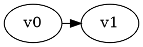

# Temporis

Temporal reachability game solver with two solving algorithms.

## Building

```bash
cmake -S . -B build -DCMAKE_BUILD_TYPE=Release
cmake --build build -j$(nproc)
```

This creates two executables in `build/temporis_solvers/`:
- `build/temporis_solvers/temporis` - Backwards propagation solver
- `build/temporis_solvers/temporis_static_expansion` - Static expansion solver

## Usage

### Backwards Propagation Solver
```bash
./build/temporis_solvers/temporis game.dot
./build/temporis_solvers/temporis --time-only game.dot    # Output only solve time
./build/temporis_solvers/temporis --verbose game.dot      # Detailed output
```

### Static Expansion Solver  
```bash
./build/temporis_solvers/temporis_static_expansion game.dot
./build/temporis_solvers/temporis_static_expansion --time-only game.dot    # Output only solve time
./build/temporis_solvers/temporis_static_expansion --verbose game.dot      # Detailed output
```

### Command Line Options
Both solvers support the following options:
- `-v, --verbose` - Enable verbose output with detailed solution information
- `-d, --debug` - Enable debug output (includes verbose)
- `-t, --time-bound N` - Set solver time bound (default from game file)
- `--validate` - Validate file format only, don't solve
- `--csv` - Output results in CSV format
- `--time-only` - Output only timing information (for benchmarking)
- `-h, --help` - Show help message

## Input Format

DOT format with temporal constraints:

## Requirements

- C++20 compatible compiler
- CMake 3.20+
- Boost Graph Library
- GGG library (for integration, URL https://github.com/gamegraphgym/ggg)