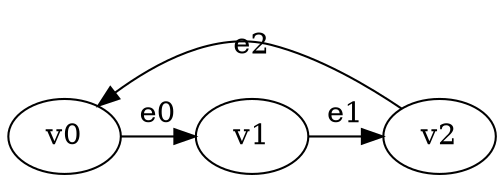

# GGG Temporis: Presburger Temporal Reachability Solver

A **GGG-native temporal game solver** implementing **Presburger arithmetic constraints** with **existential quantifiers**. Fully integrated with the Game Graph Gym framework using native data structures and solver interfaces.

## 🌟 Features

- **🎮 GGG Integration**: Native `Solver<GraphType, SolutionType>` implementation
- **🧮 Presburger Constraints**: Full support for linear arithmetic over integers  
- **∃ Existential Quantifiers**: Express complex mathematical relationships with unlimited variables
- **🔢 Multi-Variable Support**: Constraints with multiple temporal and quantified variables
- **📝 DOT Format Input**: Standard graph format with custom temporal annotations
- **📊 Multiple Output Formats**: Standard, CSV, and time-only output for different use cases
- **⚡ Professional Build System**: Modern CMake with GGG dependency management
- **🧪 Comprehensive Testing**: Multiple constraint scenarios included

## 🚀 Quick Start

### Prerequisites
- GGG library (Game Graph Gym) in sibling directory
- C++20 compatible compiler
- CMake 3.20+
- Boost Graph Library

### Build
```bash
mkdir build && cd build
cmake ..
make
```

### Run Examples
```bash
# Test temporal constraints
./temporis ../input-files/simple_constraint_test.dot
./temporis ../input-files/spec_test.dot

# Verbose output for debugging
./temporis --verbose ../input-files/spec_test_commented.dot

# CSV output for benchmarking
./temporis --csv ../input-files/spec_test.dot

# Time-only output for performance analysis
./temporis --time-only ../input-files/simple_constraint_test.dot

# Invalid constraint testing
./temporis ../input-files/invalid_test.dot
```

## 🏛️ Architecture

### GGG-Integrated Components

The project is **fully integrated with the GGG library** using native GGG data structures and solver interfaces:

```
temporis/
├── include/                           # Header files (.hpp)
│   ├── ggg_temporal_graph.hpp        # GGG-compatible temporal graph with Presburger parsing
│   ├── ggg_temporal_solver.hpp       # GGG Solver interface implementation
│   ├── presburger_formula.hpp        # Mathematical formula representation
│   └── presburger_term.hpp           # Mathematical term operations
├── src/                               # Implementation files (.cpp)
│   ├── main_ggg.cpp                  # GGG-integrated entry point
│   ├── ggg_temporal_graph.cpp        # Native GGG graph with constraint parsing
│   ├── ggg_temporal_solver.cpp       # Backwards temporal attractor solver
│   ├── presburger_formula.cpp        # Constraint evaluation engine
│   └── presburger_term.cpp           # Term arithmetic operations
└── input-files/                      # DOT test files with temporal constraints
```

### Key Components

#### **🎯 GGGTemporalReachabilitySolver**
- **Purpose**: Main solver implementing GGG's `Solver<GraphType, SolutionType>` interface
- **Algorithm**: Backwards temporal attractor algorithm working from maximum time to 0
- **Features**: Brute-force attractor computation, winning region synthesis, player-specific strategies
- **Integration**: Returns `RSSolution<GGGTemporalGraph>` with regions and strategies

#### **📊 GGGTemporalGameManager** 
- **Purpose**: Graph management using GGG's native `boost::adjacency_list`
- **Features**: Vertex/edge management, constraint evaluation, DOT file parsing
- **Integration**: Uses `DEFINE_GAME_GRAPH` macro for type generation

#### **🧮 PresburgerFormula & PresburgerTerm**
- **Purpose**: Mathematical constraint representation and evaluation
- **Features**: Complete 10-operation arithmetic (=, >=, <=, >, <, %, &&, ||, !, ∃)
- **Integration**: Embedded in GGG graph edge properties with full operation verification

## 📝 Constraint Language

### Comprehensive Presburger Arithmetic Support
The system implements **all 10 Presburger operations** with full verification:

- **Comparisons**: `=`, `>=`, `<=`, `>`, `<` 
- **Modular arithmetic**: `time % 3 == 1` (modulus constraints)
- **Boolean logic**: `&&` (AND), `||` (OR), `!` (NOT)
- **Quantification**: `∃` (existential quantifiers)

### Basic Constraints
- **Linear inequalities**: `time <= 5`, `time >= 3`, `2*time + 1 <= 10`
- **Equality**: `time = 7`, `3*time = 12`
- **Complex expressions**: Multi-term linear combinations

### Existential Quantifiers
Express existence of integer values satisfying conditions:

```
∃k. time = 2*k + 1              # time is odd
∃k. time = 3*k + 1              # time ≡ 1 (mod 3)  
∃j. ∃k. time = j + 2*k          # complex multi-variable
∃a. ∃b. ∃c. time = a + b + c + 15   # unlimited variables
```

### Multi-Variable Support
The architecture supports **unlimited variables** with scalable performance:
```
∃a. ∃b. ∃c. ∃d. ∃e. ∃f. ∃g. time = a + b + c + d + e + f + g + 15
```
## 🎮 Game Format

### Vertex Properties
- **name**: Unique vertex identifier (v0, v1, v2, ...)
- **player**: Game player (0 or 1)

### Edge Properties  
- **label**: Edge identifier (e0, e1, e2, ...)
- **constraint**: Presburger formula determining edge availability

### Example DOT File


## 🧮 Mathematical Foundations

### Presburger Arithmetic
The constraint language supports:
- **Linear arithmetic**: Addition, subtraction, scalar multiplication
- **Comparisons**: =, <=, >=, <, >
- **Existential quantification**: ∃ operator with unlimited variables
- **Complex expressions**: Multi-term linear combinations

### Temporal Semantics
- **Time Variable**: `time` represents discrete time steps (0, 1, 2, ...)
- **Edge Availability**: Constraints determine when edges are traversable
- **Game Evolution**: Players make moves based on available edges at current time

### Constraint Evaluation
The system evaluates constraints at each time step:
1. **Parse** Presburger formulas with comprehensive regex-based parser
2. **Substitute** current time value for variable `time`
3. **Evaluate** existential quantifiers by testing integer witnesses
4. **Determine** edge availability based on constraint satisfaction

## 🧪 Test Suite

The `input-files/` directory contains carefully designed test files demonstrating system capabilities:

### **Available Test Files**
- **`simple_constraint_test.dot`**: Basic temporal constraints with simple reachability
- **`spec_test.dot`**: Specification test with complex Presburger constraints
- **`spec_test_commented.dot`**: Same as spec_test.dot but with detailed comments
- **`invalid_test.dot`**: Error handling test with malformed constraints

### **Running Tests**
```bash
# Basic functionality
./temporis ../input-files/simple_constraint_test.dot

# Complex constraints  
./temporis ../input-files/spec_test.dot

# Verbose debugging
./temporis --verbose ../input-files/spec_test_commented.dot

# Error handling
./temporis ../input-files/invalid_test.dot
```

## 🎯 GGG Integration Details

### **Native GGG Features Used**
- **Graph Definition**: `DEFINE_GAME_GRAPH(GGGTemporal, ...)` macro for type generation
- **Solver Interface**: Inherits from `Solver<GGGTemporalGraph, RSSolution<GGGTemporalGraph>>`
- **Solution Types**: Returns `RSSolution<>` with winning regions and strategies
- **Graph Operations**: Uses `boost::graph_traits`, `boost::vertices`, `boost::edges`
- **Utilities**: Leverages `ggg::graphs::add_vertex`, `ggg::graphs::add_edge`

### **Solver Integration**
```cpp
// Native GGG solver implementation using backwards temporal attractor
class GGGTemporalReachabilitySolver : public Solver<graphs::GGGTemporalGraph, RSSolution<graphs::GGGTemporalGraph>> {
public:
    SolutionType solve(const GraphType& graph) override;
    std::string get_name() const override { return "Backwards Temporal Attractor Solver"; }
};
};
```

### **Build Dependencies**  
```cmake
# Modern CMake with GGG integration
target_include_directories(temporis PRIVATE 
    ${CMAKE_SOURCE_DIR}/include
    ${CMAKE_SOURCE_DIR}/../ggg/include
)
```

### File Structure
```
Source Files:
├── ggg_temporal_solver.cpp      (194 lines) - Backwards temporal attractor
├── ggg_temporal_graph.cpp       (412 lines) - Graph and constraint management  
├── presburger_formula.cpp       (161 lines) - Mathematical constraint evaluation
├── presburger_term.cpp          (79 lines)  - Term arithmetic operations
└── main_ggg.cpp                 (246 lines) - GGG integration and CLI

Header Files:
├── ggg_temporal_solver.hpp      (148 lines) - Solver interface declarations
├── ggg_temporal_graph.hpp       (119 lines) - Graph type definitions
├── presburger_formula.hpp       (50 lines)  - Formula interface
└── presburger_term.hpp          (28 lines)  - Term interface
```

## 📊 Analysis Output

The system provides multiple output formats for different use cases:

### Standard Output
```
Solver: Backwards Temporal Attractor Solver

=== Solution ===
Status: Solved
Valid: Yes

Winning Regions:
  v0: Player 1
  v1: Player 1
```

### CSV Output (`--csv`)
Provides machine-readable format for benchmarking and analysis:
```
Backwards Temporal Attractor Solver,simple_constraint_test,solved,0.000013,0.000000,0.000013,50
```

**CSV Format**: `solver_name,game_name,status,total_time,constraint_time,traversal_time,states_explored`

### Time-Only Output (`--time-only`)
Returns just the solve time in seconds for performance measurement:
```
0.000010
```

### Verbose Output (`--verbose`)
Complete diagnostic information including step-by-step attractor computation and detailed statistics:

```
Starting backwards attractor from time 50 with 1 target vertices: {v0}
Time 49: attractor has 1 vertices: {v1}
Time 48: attractor has 1 vertices: {v0}
...

=== Solver Statistics ===
State space exploration:
  States explored: 50
  States pruned: 0
  Max time reached: 0

Constraint evaluation:
  Total evaluations: 100
  Successful: 95
  Failed: 5
  Success ratio: 95.00%

Memoization performance:
  Cache hits: 0
  Cache misses: 0
  Hit ratio: 0.00%

Timing (seconds):
  Total solve time: 0.0001s
  Constraint evaluation: 0.0000s
  Graph traversal: 0.0001s
```

Winning Regions:
  v0: Player 0
  v1: Player 0 -> v0
```

Time 2:  
  v0 -> v1 (e0): ACTIVE [time >= 2]
  v1 -> v2 (e1): ACTIVE [time <= 8]

Time 5:
  v2 -> v3 (e2): ACTIVE [time = 5]
```


## 🔧 Dependencies

- **GGG Library**: Game Graph Gym framework (sibling directory)
  - **⚠️ Compatibility**: Tested with GGG version from September 19th, 2025
  - **Note**: Future GGG versions may change architecture - this implementation is designed for the September 2025 API
- **C++20**: Modern C++ compiler with full C++20 support
- **CMake**: Version 3.20 or higher
- **Boost**: Graph library (automatically found by CMake)

## 🎯 Command Line Options

```bash
temporis [OPTIONS] <input_file.dot>

OPTIONS:
  -v, --verbose          Enable verbose output
  -d, --debug            Enable debug output (includes verbose)
  -t, --time-bound N     Set solver time bound (default: 50)
  --validate             Validate file format only
  --csv                  Output results in CSV format
  --time-only            Output only timing information
  -h, --help             Show help message

EXAMPLES:
  temporis game.dot                 # Solve reachability game
  temporis --verbose game.dot       # Detailed output
  temporis -t 100 game.dot          # Custom time bound
  temporis --csv game.dot           # CSV output for benchmarking
  temporis --time-only game.dot     # Just solve time in seconds
```