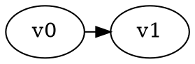

# Temporis

Temporal reachability game solver with two solving algorithms.

## Building

```bash
cmake -S . -B build -DCMAKE_BUILD_TYPE=Release
cmake --build build
```

This creates two executables:
- `build/temporis` - Backwards propagation solver
- `build/temporis_static_expansion` - Static expansion solver

## Usage

### Backwards Propagation Solver
```bash
./build/temporis game.dot
./build/temporis --time-only game.dot    # Output only solve time
./build/temporis --verbose game.dot      # Detailed output
```

### Static Expansion Solver  
```bash
./build/temporis_static_expansion game.dot
./build/temporis_static_expansion --time-only game.dot    # Output only solve time
./build/temporis_static_expansion --verbose game.dot      # Detailed output
```

## Input Format

DOT format with temporal constraints:

## Requirements

- C++20 compatible compiler
- CMake 3.20+
- Boost Graph Library
- GGG library (for integration, URL https://github.com/gamegraphgym/ggg)