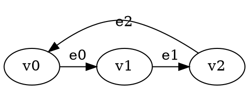
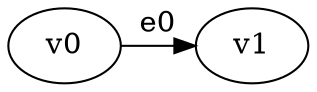

# Temporis: Advanced Presburger Temporal Games

A C++20 framework for analyzing temporal games with **Presburger arithmetic constraints** and **existential quantifiers**.

## Features

- **2-Player Temporal Games**: Standard game format with players 0 and 1
- **Presburger Constraints**: Full support for linear arithmetic over integers
- **Existential Quantifiers**: Express complex mathematical relationships
- **Multiple Variables**: Support for constraints with multiple temporal variables
- **DOT Format Input**: Standard graph format with custom temporal annotations
- **Professional Build System**: CMake-based with proper directory structure

## Quick Start

### Build
```bash
mkdir build && cd build
cmake ..
make
```

### Run Example
```bash
./build/temporis input-files/example_temporal.dot
./build/temporis input-files/complex_temporal_game.dot
./build/temporis input-files/advanced_presburger_game.dot
```

## Constraint Language

### Basic Constraints
- **Linear inequalities**: `time <= 5`, `time >= 3`, `2*time + 1 <= 10`
- **Equality**: `time = 7`, `3*time = 12`
- **Modular arithmetic**: `time % 3 = 1`

### Existential Quantifiers
Express existence of integer values satisfying conditions:

```
exists k. time = 2*k + 1    # time is odd
exists k. time = 3*k + 1    # time ≡ 1 (mod 3)
exists j. exists k. time = j + 2*k    # complex multi-variable
```

### Multi-Variable Support
Constraints can reference multiple temporal variables and quantified variables:
```
exists k. exists j. time = 2*k + 3*j + 1
```

## Game Format

### Vertex Properties
- **name**: Unique vertex identifier (v0, v1, v2, ...)
- **player**: Game player (0 or 1)

### Edge Properties  
- **name**: Unique edge identifier (e0, e1, e2, ...)
- **constraint**: Presburger formula determining edge availability

### Example DOT File


## Mathematical Foundations

### Presburger Arithmetic
The constraint language supports:
- **Linear arithmetic**: Addition, subtraction, scalar multiplication
- **Comparisons**: =, <=, >=, <, >
- **Modular arithmetic**: % operator
- **Existential quantification**: exists keyword

### Temporal Semantics
- **Time Variable**: `time` represents discrete time steps (0, 1, 2, ...)
- **Edge Availability**: Constraints determine when edges are traversable
- **Game Evolution**: Players make moves based on available edges at current time

### Constraint Evaluation
The system evaluates constraints at each time step:
1. **Parse** Presburger formulas with regex-based parser
2. **Substitute** current time value for variable `time`
3. **Evaluate** existential quantifiers by testing integer witnesses
4. **Determine** edge availability based on constraint satisfaction

## Architecture

### Core Components
- **PresburgerTerm**: Represents linear expressions with coefficients
- **PresburgerTemporalDotParser**: Parses DOT files with temporal annotations
- **Constraint Evaluator**: Evaluates Presburger formulas with existential quantifiers

### Build System
- **CMake**: Professional build configuration
- **C++20**: Modern C++ with advanced template features
- **Boost**: Graph library integration
- **Directory Structure**: Organized src/, input-files/, build/ layout

## Examples

### Simple Game (`example_temporal.dot`)
Basic 2-player game with linear constraints.

### Complex Game (`complex_temporal_game.dot`)
Multi-vertex game with various constraint types.

### Advanced Game (`advanced_presburger_game.dot`)
Demonstrates existential quantifiers and complex mathematical relationships:
- Odd time constraints: `exists k. time = 2*k + 1`
- Modular arithmetic: `exists k. time = 3*k + 1`
- Multi-variable formulas: Complex quantified expressions

## Pattern Analysis

The system provides detailed analysis of temporal evolution:
- **Edge Activity**: Shows when each edge is available
- **Constraint Evaluation**: Real-time formula satisfaction
- **Pattern Recognition**: Identifies mathematical relationships

Example output:
```
v1->v2 active at times: 1 3 5 7    # Odd times (exists k. time = 2*k + 1)
v2->v3 active at times: 0 2 4 6 8  # Even times (exists k. time = 2*k + 0)  
v3->v4 active at times: 3 4 5 6 7 8 # time >= 3
```

## Dependencies

- **C++20**: Modern C++ compiler with full C++20 support
- **CMake**: Version 3.15 or higher
- **Boost**: Graph library (automatically found by CMake)

## License

This project uses advanced mathematical concepts and professional software engineering practices.
Built with modern C++20 and designed for research in temporal game theory.

---

*Temporis: Where time meets mathematics in game theory.*
# DOT file input is required
./main example_temporal.dot

# Use complex example
./main complex_temporal_game.dot

# Usage message shown if no file provided
./main
```rectory contains examples of 2-player temporal games using Presburger arithmetic constraints for edge availability, built with the Game Graph Gym (GGG) library.

## Files Overview

### `main.cpp`
**2-player temporal game with Presburger arithmetic constraints**
- Simple vertex naming (v0, v1, v2, ...) following GGG conventions
- 2-player game structure (player 0 and player 1 vertices)
- Edge availability determined solely by Presburger arithmetic formulas
- DOT file input parser for game specification (no hardcoded examples)

**Key Features:**
- PresburgerTemporalGameManager class
- Complete DOT file parser with regex-based parsing
- Presburger arithmetic constraint evaluation
- Temporal game state simulation
- Real-time edge availability analysis based on mathematical constraints

### `example_temporal.dot`
**DOT format input file for Presburger temporal games**
- Simple vertex declarations with player assignments: `v0 [name="v0", player=0];`
- Edge constraints using Presburger arithmetic: `v0 -> v1 [label="e0", constraint="t >= 2"];`
- Follows GGG test suite file format conventions

### `complex_temporal_game.dot`
**More complex example with additional constraint patterns**
- Demonstrates various Presburger constraint types
- Larger game graph with 6 vertices and 8 edges
- Mixed constraint patterns showing different temporal behaviors

**Constraint Examples:**
- `t >= 2` - Edge active from time 2 onwards
- `t = 3` - Edge active only at time 3
- `t <= 5` - Edge active up to time 5
- No constraint - Edge always active

## Usage

### Compilation
```bash
cd temporis
g++ -std=c++20 -I../ggg/include presburger_temporal_graph_example.cpp -o presburger_temporal_graph_example
```

### Execution
```bash
# Use default example_temporal.dot
./presburger_temporal_graph_example

# Use custom DOT file
./presburger_temporal_graph_example complex_temporal_game.dot
```

## Game Structure

The implementation creates a 2-player temporal game where:
- **Player 0** owns vertices: v0, v2, v4
- **Player 1** owns vertices: v1, v3
- **Edge availability** is determined by Presburger arithmetic constraints evaluated at each time step

## Presburger Constraints

The system supports basic Presburger arithmetic including:
- **Equality**: `t = 3` (edge active only at time 3)
- **Inequalities**: `t >= 2`, `t <= 5` (edge active when condition holds)
- **Existential quantification**: Can be extended with `∃k. (constraint involving k)`

## Example Output

```
=== Game Structure ===
Player 0 vertices: v0 v2 v4 
Player 1 vertices: v1 v3 

=== Presburger Temporal Game State at Time 3 ===
Edge Availability (Presburger Constraints):
  v0 -> v1 (e0): ACTIVE [t >= 2]
  v0 -> v4 (e4): ACTIVE
  v1 -> v2 (e1): ACTIVE [t = 3]
  v2 -> v3 (e2): ACTIVE [t <= 5]
  v3 -> v4 (e3): INACTIVE [t >= 4]
```

This demonstrates how mathematical constraints control the temporal availability of game edges, creating dynamic game graphs that evolve over time according to precise Presburger arithmetic formulas.

## Technical Architecture

### Graph Field Definitions
The example uses simplified GGG macro system for 2-player games:
```cpp
#define PRESBURGER_TEMPORAL_VERTEX_FIELDS(X) \
    X(std::string, name)                     \
    X(int, player)

#define PRESBURGER_TEMPORAL_EDGE_FIELDS(X) \
    X(std::string, label)

DEFINE_GAME_GRAPH(PresburgerTemporal, PRESBURGER_TEMPORAL_VERTEX_FIELDS, PRESBURGER_TEMPORAL_EDGE_FIELDS, PRESBURGER_TEMPORAL_GRAPH_FIELDS)
```

### Presburger Arithmetic
Mathematical constraint evaluation through:
- `PresburgerTerm` - Variables and constants in linear arithmetic
- `PresburgerFormula` - Equality, inequality, and logical operations
- Real-time constraint evaluation at each time step

### DOT File Format
Input-only format compatible with GGG test suite structure:


**Parsing Features:**
- Complete regex-based DOT file parsing
- Automatic vertex and edge detection
- Constraint parsing for `t >= n`, `t = n`, `t <= n` patterns
- No hardcoded examples - all content from input files

## Design Philosophy

This implementation focuses on:
- **Input-Only Operation**: No hardcoded examples, all content from DOT files
- **Complete DOT Parsing**: Regex-based parser for vertices, edges, and constraints
- **Simplicity**: Minimal vertex properties, only name and player
- **Mathematical Precision**: Edge availability controlled solely by Presburger constraints
- **GGG Compatibility**: Follows Game Graph Gym naming and structural conventions
- **2-Player Games**: Standard game-theoretic framework
- **Required Input Files**: Enforces proper usage by requiring DOT file arguments
