# Temporis: Temporal Reachability Game Solver

Solves reachability games on graphs with time-dependent edge constraints using Presburger arithmetic.

## Quick Start

**Prerequisites:** GGG library (in `../ggg/`), C++20, CMake 3.20+, Boost Graph

**Build:**
```bash
mkdir build && cd build
cmake .. && make
```

**Usage:**
```bash
./temporis input-files/simple_constraint_test.dot
./temporis input-files/spec_test.dot
```

## Input Format

Games are defined in DOT format with temporal constraints on edges:

```dot
digraph TemporalGame {
    v0 [name="v0", player=0, target=1];  // player 0, target vertex
    v1 [name="v1", player=1];            // player 1
    
    v0 -> v1 [constraint="time >= 5"];   // edge available from time 5 onward
    v1 -> v0 [constraint="time % 2 == 0"]; // edge available on even times
}
```



## Constraint Language

Supports Presburger arithmetic with existential quantifiers:

- **Basic**: `time >= 5`, `time <= 10`, `time == 7`
- **Modular**: `time % 3 == 1`  
- **Boolean**: `time >= 2 && time <= 8`, `!(time < 5)`
- **Existential**: `exists x. time >= 2*x + 1` (time is odd)
## Output

Determines which player can win from which vertices:

```
Solver: Backwards Temporal Attractor Solver

=== Solution ===
Status: Solved
Valid: Yes

Winning Regions:
  v0: Player 0
  v1: Player 1
```

## Command Line Options

```bash
./temporis [OPTIONS] <input_file.dot>

Options:
  --verbose              Show detailed solving steps
  --csv                  Output in CSV format for benchmarking  
  --time-only            Output only solve time
  -t N                   Set time bound (default: 50)
```