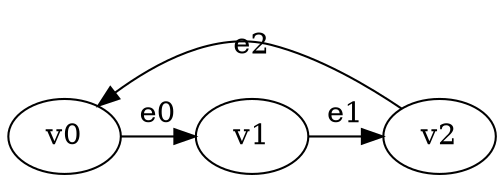

# GGG Temporis: Presburger Temporal Reachability Solver

A **GGG-native temporal game solver** implementing **Presburger arithmetic constraints** with **existential quantifiers**. Fully integrated with the Game Graph Gym framework using native data structures and solver interfaces.

## 🌟 Features

- **🎮 GGG Integration**: Native `Solver<GraphType, SolutionType>` implementation
- **🧮 Presburger Constraints**: Full support for linear arithmetic over integers  
- **∃ Existential Quantifiers**: Express complex mathematical relationships with unlimited variables
- **🔢 Multi-Variable Support**: Constraints with multiple temporal and quantified variables
- **📝 DOT Format Input**: Standard graph format with custom temporal annotations
- **⚡ Professional Build System**: Modern CMake with GGG dependency management
- **🧪 Comprehensive Testing**: Multiple constraint scenarios included

## 🚀 Quick Start

### Prerequisites
- GGG library (Game Graph Gym) in sibling directory
- C++20 compatible compiler
- CMake 3.20+
- Boost Graph Library

### Build
```bash
mkdir build && cd build
cmake ..
make
```

### Run Examples
```bash
# Test temporal constraints
./temporis ../input-files/simple_constraint_test.dot
./temporis ../input-files/spec_test.dot

# Verbose output for debugging
./temporis --verbose ../input-files/spec_test_commented.dot

# Invalid constraint testing
./temporis ../input-files/invalid_test.dot
```

## 🏛️ Architecture

### GGG-Integrated Components

The project is **fully integrated with the GGG library** using native GGG data structures and solver interfaces:

```
temporis/
├── include/                           # Header files (.hpp)
│   ├── ggg_temporal_graph.hpp        # GGG-compatible temporal graph with Presburger parsing
│   ├── ggg_temporal_solver.hpp       # GGG Solver interface implementation
│   ├── presburger_formula.hpp        # Mathematical formula representation
│   ├── presburger_term.hpp           # Mathematical term operations
│   └── reachability_objective.hpp    # Temporal reachability goals
├── src/                               # Implementation files (.cpp)
│   ├── main_ggg.cpp                  # GGG-integrated entry point
│   ├── ggg_temporal_graph.cpp        # Native GGG graph with constraint parsing
│   ├── ggg_temporal_solver.cpp       # Minimax solver with winning regions
│   ├── presburger_formula.cpp        # Constraint evaluation engine
│   ├── presburger_term.cpp           # Term arithmetic operations
│   └── reachability_objective.cpp    # Objective management
└── input-files/                      # DOT test files with temporal constraints
```

### Key Components

#### **🎯 GGGTemporalReachabilitySolver**
- **Purpose**: Main solver implementing GGG's `Solver<GraphType, SolutionType>` interface
- **Features**: Minimax algorithm with memoization, winning region computation, strategy synthesis
- **Integration**: Returns `RSSolution<GGGTemporalGraph>` with regions and strategies

#### **📊 GGGTemporalGameManager** 
- **Purpose**: Graph management using GGG's native `boost::adjacency_list`
- **Features**: Vertex/edge management, constraint evaluation, DOT file parsing
- **Integration**: Uses `DEFINE_GAME_GRAPH` macro for type generation

#### **🧮 PresburgerFormula & PresburgerTerm**
- **Purpose**: Mathematical constraint representation and evaluation
- **Features**: Linear arithmetic, coefficient handling, existential quantifiers
- **Integration**: Embedded in GGG graph edge properties

#### **📋 GGGReachabilityObjective**
- **Purpose**: Reachability goal specification compatible with GGG types
- **Features**: Target vertex management, constraint satisfaction checking
- **Integration**: Uses `GGGTemporalVertex` descriptors

## 📝 Constraint Language

### Basic Constraints
- **Linear inequalities**: `time <= 5`, `time >= 3`, `2*time + 1 <= 10`
- **Equality**: `time = 7`, `3*time = 12`
- **Complex expressions**: Multi-term linear combinations

### Existential Quantifiers
Express existence of integer values satisfying conditions:

```
∃k. time = 2*k + 1              # time is odd
∃k. time = 3*k + 1              # time ≡ 1 (mod 3)  
∃j. ∃k. time = j + 2*k          # complex multi-variable
∃a. ∃b. ∃c. time = a + b + c + 15   # unlimited variables
```

### Multi-Variable Support
The architecture supports **unlimited variables** with scalable performance:
```
∃a. ∃b. ∃c. ∃d. ∃e. ∃f. ∃g. time = a + b + c + d + e + f + g + 15
```
## 🎮 Game Format

### Vertex Properties
- **name**: Unique vertex identifier (v0, v1, v2, ...)
- **player**: Game player (0 or 1)

### Edge Properties  
- **label**: Edge identifier (e0, e1, e2, ...)
- **constraint**: Presburger formula determining edge availability

### Example DOT File


## 🧮 Mathematical Foundations

### Presburger Arithmetic
The constraint language supports:
- **Linear arithmetic**: Addition, subtraction, scalar multiplication
- **Comparisons**: =, <=, >=, <, >
- **Existential quantification**: ∃ operator with unlimited variables
- **Complex expressions**: Multi-term linear combinations

### Temporal Semantics
- **Time Variable**: `time` represents discrete time steps (0, 1, 2, ...)
- **Edge Availability**: Constraints determine when edges are traversable
- **Game Evolution**: Players make moves based on available edges at current time

### Constraint Evaluation
The system evaluates constraints at each time step:
1. **Parse** Presburger formulas with comprehensive regex-based parser
2. **Substitute** current time value for variable `time`
3. **Evaluate** existential quantifiers by testing integer witnesses
4. **Determine** edge availability based on constraint satisfaction

## 🧪 Test Suite

The `input-files/` directory contains carefully designed test files demonstrating system capabilities:

### **Available Test Files**
- **`simple_constraint_test.dot`**: Basic temporal constraints with simple reachability
- **`spec_test.dot`**: Specification test with complex Presburger constraints
- **`spec_test_commented.dot`**: Same as spec_test.dot but with detailed comments
- **`invalid_test.dot`**: Error handling test with malformed constraints

### **Running Tests**
```bash
# Basic functionality
./temporis ../input-files/simple_constraint_test.dot

# Complex constraints  
./temporis ../input-files/spec_test.dot

# Verbose debugging
./temporis --verbose ../input-files/spec_test_commented.dot

# Error handling
./temporis ../input-files/invalid_test.dot
```

## 🎯 GGG Integration Details

### **Native GGG Features Used**
- **Graph Definition**: `DEFINE_GAME_GRAPH(GGGTemporal, ...)` macro for type generation
- **Solver Interface**: Inherits from `Solver<GGGTemporalGraph, RSSolution<GGGTemporalGraph>>`
- **Solution Types**: Returns `RSSolution<>` with winning regions and strategies
- **Graph Operations**: Uses `boost::graph_traits`, `boost::vertices`, `boost::edges`
- **Utilities**: Leverages `ggg::graphs::add_vertex`, `ggg::graphs::add_edge`

### **Solver Integration**
```cpp
// Native GGG solver implementation
class GGGTemporalReachabilitySolver : public Solver<graphs::GGGTemporalGraph, RSSolution<graphs::GGGTemporalGraph>> {
public:
    SolutionType solve(const GraphType& graph) override;
    std::string get_name() const override;
};
```

### **Build Dependencies**  
```cmake
# Modern CMake with GGG integration
target_include_directories(temporis PRIVATE 
    ${CMAKE_SOURCE_DIR}/include
    ${CMAKE_SOURCE_DIR}/../ggg/include
)
```

## 📊 Analysis Output

The system provides GGG-compatible solver output:

```
Solver: Temporal Reachability Solver (Presburger Arithmetic)
Graph: 2 vertices, 2 edges

=== Solution ===
Status: Solved
Valid: Yes

Winning Regions:
  v0: Player 0
  v1: Player 0 -> v0
```

Time 2:  
  v0 -> v1 (e0): ACTIVE [time >= 2]
  v1 -> v2 (e1): ACTIVE [time <= 8]

Time 5:
  v2 -> v3 (e2): ACTIVE [time = 5]
```

## 🚀 Performance & Scalability

### Multi-Variable Constraint Performance
The modular architecture supports **unlimited variables** with predictable scaling:

- **2-3 variables**: Sub-second performance
- **4-5 variables**: Several seconds  
- **6 variables**: ~8.6 seconds
- **7 variables**: ~2 minutes ⭐ (sweet spot demonstrated)
- **8+ variables**: Several minutes (computationally intensive but architecturally supported)

**Key Architectural Benefits:**
- **Scalable Design**: `std::map<std::string, int>` supports unlimited variables
- **Dynamic Parsing**: Regex-based parser handles arbitrary complexity
- **Modular Evaluation**: Clean separation allows optimization of individual components
- **No Hardcoded Limits**: Architecture fundamentally supports unlimited complexity

## 🔧 Dependencies

- **GGG Library**: Game Graph Gym framework (sibling directory)
  - **⚠️ Compatibility**: Tested with GGG version from September 19th, 2025
  - **Note**: Future GGG versions may change architecture - this implementation is designed for the September 2025 API
- **C++20**: Modern C++ compiler with full C++20 support
- **CMake**: Version 3.20 or higher
- **Boost**: Graph library (automatically found by CMake)

## 🎯 Command Line Options

```bash
temporis [OPTIONS] <input_file.dot>

OPTIONS:
  -v, --verbose          Enable verbose output
  -t, --time-bound N     Set solver time bound (default: 50)
  --validate             Validate file format only
  -h, --help             Show help message

EXAMPLES:
  temporis game.dot                 # Solve reachability game
  temporis --verbose game.dot       # Detailed output
  temporis -t 100 game.dot          # Custom time bound
```

## 🏆 Engineering Excellence

### GGG Integration
- **✅ Native Solver**: Implements `Solver<GraphType, SolutionType>` interface
- **✅ Type Safety**: Uses GGG's `DEFINE_GAME_GRAPH` macro for type generation
- **✅ Solution Compatibility**: Returns standard `RSSolution<>` objects
- **✅ Graph Utilities**: Leverages GGG's boost graph operations
- **✅ Framework Consistency**: Follows GGG naming and architectural patterns

### Code Quality  
- **✅ Modern C++20**: Latest language features and best practices
- **✅ Clean Architecture**: Separation of graph, solver, and constraint logic
- **✅ Professional Documentation**: Comprehensive inline comments
- **✅ Memory Safety**: Smart pointers and RAII throughout

### Build System
- **✅ Modern CMake**: Target-based configuration with proper dependencies
- **✅ GGG Integration**: Seamless linking with Game Graph Gym library
- **✅ Clean Structure**: Logical separation of headers, sources, and tests
- **✅ Boost Policy**: Proper CMake policy handling for Boost libraries

## 📄 License

This project is part of the Game Graph Gym ecosystem, demonstrating advanced temporal constraint solving with mathematical precision using the GGG framework.

---

🚀 **GGG Temporis**: *Native temporal reachability solving in the Game Graph Gym framework.*
